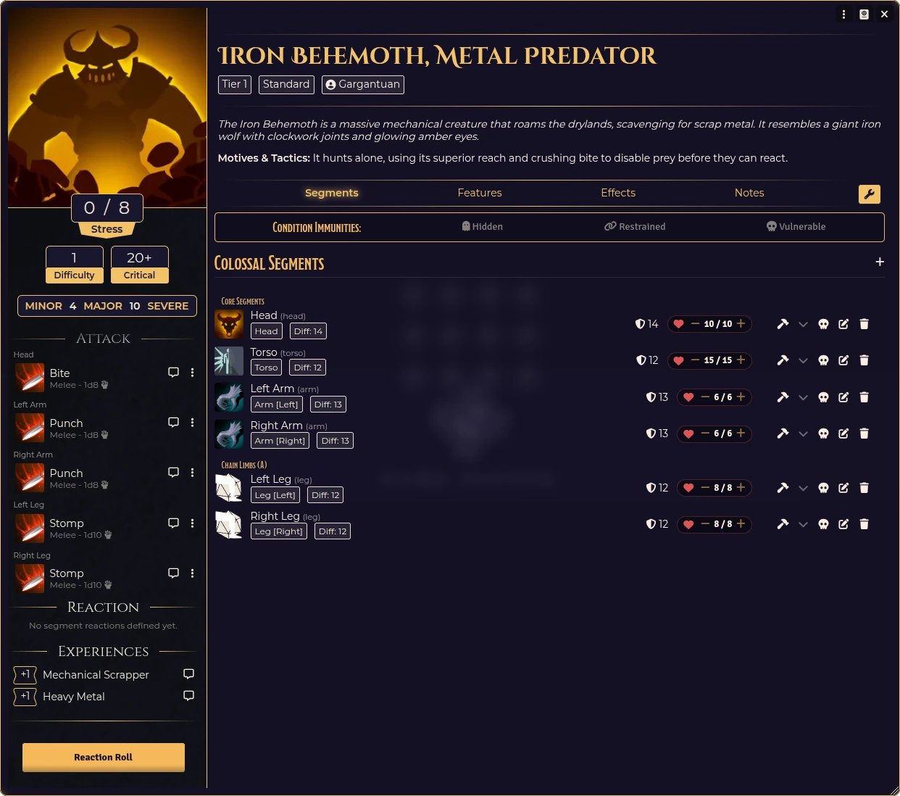

# Daggerheart: COD


A Foundry VTT supplementary module for the **[Daggerheart](https://foundryborne.online/)** system that introduces the **Colossal** adversary type and other content based around Colossus of the Drylands. This module allows you to import and manage giant, multi-segmented colossi the same way they are presented in the official source materials.

## Features

- **Colossus Actor Type:** Adds a new `Colossus` adversary actor type designed specifically for multi-segment colossi in Daggerheart.
    - **Dynamic Segments:** Manage complex colossi with multi-segmented body parts (Head, Limbs, Core, etc.), each with its own health, Difficulty/Armor, and unique abilities.
    - **Integrated Header Controls:** Quickly manage **HP**, **Attack Modifiers**, and status conditions like **Broken**, **Collapsed**, or **Destroyed** directly from the segment header.
    - **Chain Defeat Logic:** Intelligent segment organization using **Chain Groups** and **Subgroups** (e.g., Chain A, Subgroup 1). Configure defeat conditions where destroying a "Fatal" segment or an entire "Fatal Chain" (via chain group metadata) brings down the Colossus.
    - **Sheet UX & Interactivity:**
        - **Features**: Organizes the Features tab into "Core Features" and individual "Segment Features" (Head, Torso, etc.) for a cleaner, themed layout.
        - **Active Effects**: Full support for managing **Active Effects** on both the main Colossus actor and its individual segments.
        - **Context Menus**: Right-click functionality tailored to each component (Limbs, Features, and Shortcuts), ensuring intuitive editing and deletion.
- **Procedural Colossus Generator:** Instantly create unique, theme-accurate colossi through a guided UI.
    - **Thematic Logic:** Generates contextual abilities and segments based on 10+ core themes (Mechanical, Void, Aquatic, Fire, etc.).
    - **Tier-Based Scaling:** Automatically scales the number and power of attacks/features based on Tier (1-4).
    - **Customization:** Select specific archetypes (e.g., Quadruped, Avian, Serpentine) or use the **Randomize Archetype** feature.
- **Built-in Importer:** Text parser that converts stat-blocks from the Colossus of the Drylands core rulebook into fully configured Colossi. Supports complex segment naming, Fatal tags, and Chain Groups.

## Compendiums

The module includes a suite of ready-to-use compendiums:
- **Colossal Adversaries:** Pre-configured multi-segment colossi (TODO).
- **Colossal Segments:** A collection of specialized segment templates for manual builds.
- **Colossal Features & Attacks:** Compendiums of themed abilities, attacks, and reactions for custom colossi.
- **Colossal Weapons:** Equipment types based off the Colossus of the Drylands rules.
- **Colossal Loot:** Specialized rewards for Colossal-scale encounters (TODO).
- **Colossal Chain Groups:** Groups for heads, limbs, body and uncategorized chains. 

## Roll-Tables
- **Generator Tables:** Roll tables for the generator to use. 

## Importer Parameters

Below is an example of the expected format for the importer:

```text
Iron Behemoth, Metal Predator
Tier 1 Colossus

The Iron Behemoth is a massive mechanical creature that roams the drylands, scavenging for scrap metal. It resembles a giant iron wolf with clockwork joints and glowing amber eyes.

Thresholds: 4/10 | Stress: 8
Experience: Mechanical Scrapper +1, Heavy Metal +1
Motives & Tactics: It hunts alone, using its superior reach and crushing bite to disable prey before they can react.
Size: 25 ft. tall, 15 ft. wide

FEATURES
Relentless - Passive: The Iron Behemoth does not suffer from fear effects.

IRON HEAD
Adjacent Segments: Torso
Difficulty: 14 | HP: 10
ATK: +1 | Bite: Melee | 1d8 phy
FEATURES
Fatal
Crushing Jaws - Action: The target is grappled on a successful hit.

IRON TORSO
Adjacent Segments: Head, Legs, Arms
Difficulty: 12 | HP: 15
FEATURES
Sturdy Frame - Passive: Reduce damage taken by 1.

IRON ARMS (2)
Adjacent Segments: Torso
Difficulty: 13 | HP: 6
ATK: +2 | Punch: Melee | 1d8 phy
FEATURES
Chain (A) - Passive: When all segements in Chain A are destroyed, the Iron Behemoth is defeated.
Hydraulic Press - Action: Deal additional damage if the target is grappled.

IRON LEGS (2)
Adjacent Segments: Torso
Difficulty: 12 | HP: 8
ATK: +1 | Stomp: Melee | 1d10 phy
FEATURES
Chain (A) - Passive: When all segements in Chain A are destroyed, the Iron Behemoth is defeated.
Swift Leap - Action: The behemoth can leap to a very close location.
```

<a href="assets/images/iron-behemoth.webp" target="_blank">
  
</a>

## Installation

You can install this module directly in Foundry VTT by pasting the manifest link into the Add-On Modules menu:

**Manifest URL:**
`https://github.com/juvinious/fb-cod/releases/latest/download/module.json`


## License

This project is licensed under the MIT License - see the `LICENSE` file for details.
